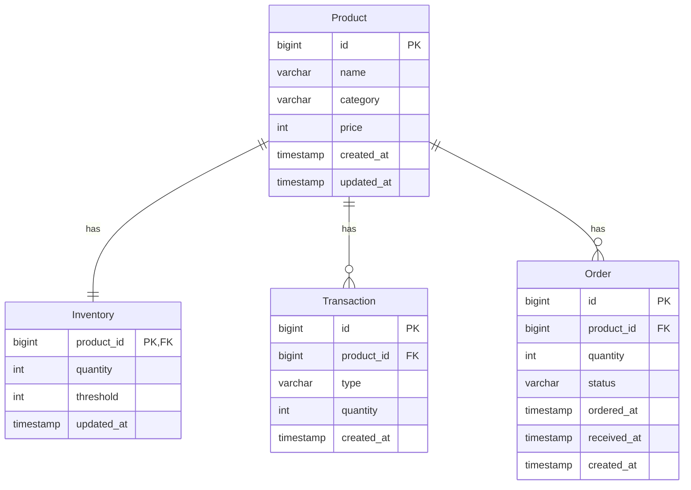

# 在庫管理システム 設計書

## 技術スタック

| 技術                   | バージョン | 用途                     |
| ---------------------- | ---------- | ------------------------ |
| Python                 | 3.12       | プログラミング言語       |
| Django                 | 5.x        | Web フレームワーク       |
| Django REST Framework  | 3.x        | RESTful API 構築         |
| MySQL                  | 8.x        | データベース             |
| pytest                 | 8.x        | ユニットテスト           |
| Playwright (TypeScript) | latest     | E2E テスト               |

## ディレクトリ構成

```
inventory-system/
├── config/                  # Django プロジェクト設定
│   ├── __init__.py
│   ├── settings.py
│   ├── urls.py
│   └── wsgi.py
├── inventory/               # メインアプリケーション
│   ├── __init__.py
│   ├── models/              # Django モデル（データ定義）
│   │   ├── __init__.py
│   │   ├── product.py
│   │   ├── inventory.py
│   │   ├── transaction.py
│   │   └── order.py
│   ├── services/            # ビジネスロジック
│   │   ├── __init__.py
│   │   ├── product_service.py
│   │   └── inventory_service.py
│   ├── serializers/         # シリアライザー（検証・変換）
│   │   ├── __init__.py
│   │   └── product_serializer.py
│   ├── views/               # API エンドポイント
│   │   ├── __init__.py
│   │   └── product_views.py
│   ├── urls.py
│   └── admin.py
├── tests/                   # テスト
│   ├── __init__.py
│   └── test_product_service.py
├── docs/                    # ドキュメント
├── sql/                     # SQL ファイル
├── manage.py
└── requirements.txt
```

## レイヤー構成

```
┌─────────────────────────────────────┐
│           View（API）               │  HTTP リクエスト/レスポンス
├─────────────────────────────────────┤
│          Serializer                 │  データ検証・変換
├─────────────────────────────────────┤
│           Service                   │  ビジネスロジック
├─────────────────────────────────────┤
│        Model（Django ORM）          │  データベースアクセス
└─────────────────────────────────────┘
```

### 各レイヤーの責務

| レイヤー   | 責務                                    |
| ---------- | --------------------------------------- |
| View       | HTTP リクエストの受付、レスポンスの返却 |
| Serializer | 入力データの検証、JSON 変換             |
| Service    | ビジネスロジックの実装                  |
| Model      | データベースとのやり取り                |

## モデル一覧

### Product（商品）

| フィールド  | 型                   | 説明           |
| ----------- | -------------------- | -------------- |
| id          | BigAutoField         | 主キー         |
| name        | CharField(100)       | 商品名         |
| category    | CharField(20)        | カテゴリ       |
| price       | PositiveIntegerField | 単価           |
| created_at  | DateTimeField        | 作成日時       |
| updated_at  | DateTimeField        | 更新日時       |

### Inventory（在庫）

| フィールド  | 型                   | 説明           |
| ----------- | -------------------- | -------------- |
| product     | OneToOneField        | 商品（主キー） |
| quantity    | PositiveIntegerField | 在庫数         |
| threshold   | PositiveIntegerField | アラート閾値   |
| updated_at  | DateTimeField        | 更新日時       |

### Transaction（取引履歴）

| フィールド  | 型                   | 説明           |
| ----------- | -------------------- | -------------- |
| id          | BigAutoField         | 主キー         |
| product     | ForeignKey           | 商品           |
| type        | CharField(10)        | 種別（IN/OUT） |
| quantity    | PositiveIntegerField | 数量           |
| created_at  | DateTimeField        | 実行日時       |

### Order（発注）

| フィールド  | 型                   | 説明           |
| ----------- | -------------------- | -------------- |
| id          | BigAutoField         | 主キー         |
| product     | ForeignKey           | 商品           |
| quantity    | PositiveIntegerField | 発注数量       |
| status      | CharField(20)        | ステータス     |
| ordered_at  | DateTimeField        | 発注日時       |
| received_at | DateTimeField        | 入荷日時       |
| created_at  | DateTimeField        | 作成日時       |

## ER 図



## 処理フロー例：商品登録

```
1. クライアント → POST /api/products/
2. View が Serializer でデータを検証
3. View が Service.create() を呼び出す
4. Service が Model.objects.create() でデータを保存
5. View が登録結果を JSON で返却
```
