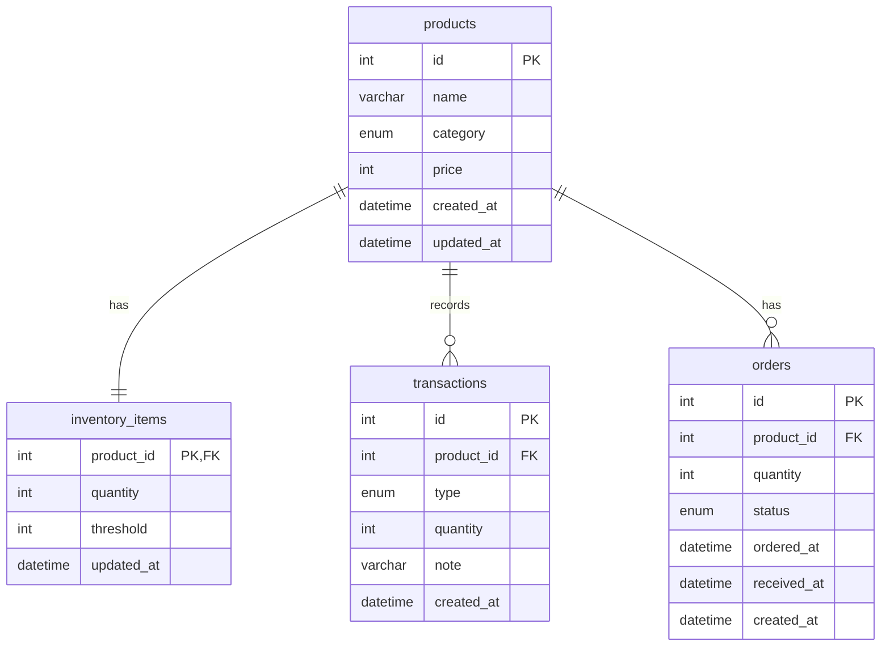
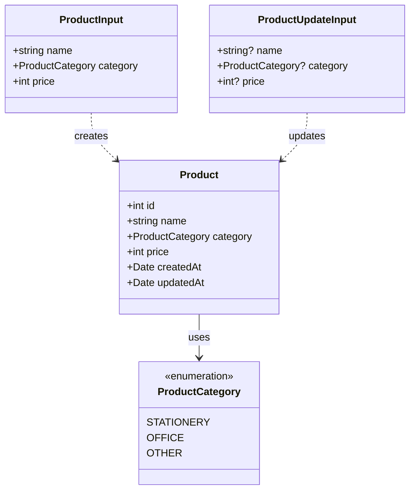

# 在庫管理システム 設計ドキュメント

## エンティティ一覧

### Product（商品）

| フィールド | 型              | 説明                |
| ---------- | --------------- | ------------------- |
| id         | number          | 商品 ID（自動採番） |
| name       | string          | 商品名              |
| category   | ProductCategory | カテゴリ            |
| price      | number          | 単価（税抜）        |
| createdAt  | Date            | 作成日時            |
| updatedAt  | Date            | 更新日時            |

**ProductCategory:**

- STATIONERY: 文房具
- OFFICE: オフィス用品
- OTHER: その他

### InventoryItem（在庫）

| フィールド | 型     | 説明         |
| ---------- | ------ | ------------ |
| productId  | number | 商品 ID      |
| quantity   | number | 現在の在庫数 |
| threshold  | number | 発注閾値     |
| updatedAt  | Date   | 最終更新日時 |

### Transaction（入出庫履歴）

| フィールド | 型              | 説明                |
| ---------- | --------------- | ------------------- |
| id         | number          | 履歴 ID（自動採番） |
| productId  | number          | 商品 ID             |
| type       | TransactionType | 入庫/出庫           |
| quantity   | number          | 数量                |
| note       | string?         | 備考                |
| createdAt  | Date            | 登録日時            |

**TransactionType:**

- IN: 入庫
- OUT: 出庫

### Order（発注）

| フィールド | 型          | 説明                |
| ---------- | ----------- | ------------------- |
| id         | number      | 発注 ID（自動採番） |
| productId  | number      | 商品 ID             |
| quantity   | number      | 発注数量            |
| status     | OrderStatus | ステータス          |
| orderedAt  | Date?       | 発注日              |
| receivedAt | Date?       | 入荷日              |
| createdAt  | Date        | 作成日時            |

**OrderStatus:**

- PENDING: 作成中
- ORDERED: 発注済み
- RECEIVED: 入荷済み
- CANCELLED: キャンセル

## ER 図



## クラス図



## バリデーションルール

### Product

| フィールド | ルール                     |
| ---------- | -------------------------- |
| name       | 必須、1〜100 文字          |
| category   | ProductCategory のいずれか |
| price      | 必須、0 以上の整数         |

### InventoryItem

| フィールド | ルール                |
| ---------- | --------------------- |
| productId  | 必須、存在する商品 ID |
| quantity   | 0 以上の整数          |
| threshold  | 0 以上の整数          |

### Transaction

| フィールド | ルール                |
| ---------- | --------------------- |
| productId  | 必須、存在する商品 ID |
| type       | IN または OUT         |
| quantity   | 1 以上の整数          |
| note       | 500 文字以内（任意）  |

### Order

| フィールド | ルール                 |
| ---------- | ---------------------- |
| productId  | 必須、存在する商品 ID  |
| quantity   | 1 以上の整数           |
| status     | OrderStatus のいずれか |

## 状態遷移（Order）

```
PENDING → ORDERED（発注実行）
PENDING → CANCELLED（キャンセル）
ORDERED → RECEIVED（入荷）
ORDERED → CANCELLED（キャンセル）
```

RECEIVED, CANCELLED からは遷移不可。
